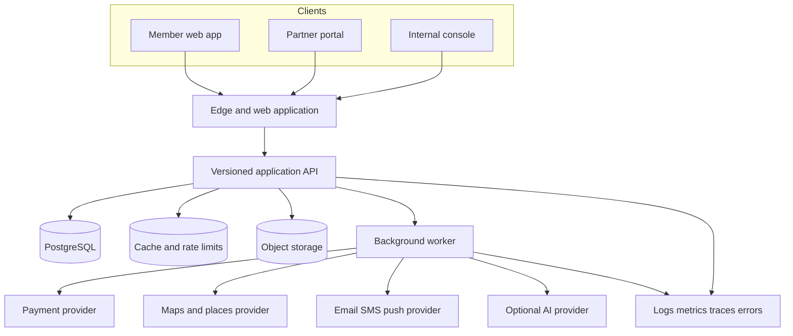

# Vibe developer blueprint

Version 1.0 | 23 September 2026 | Islamabad pilot with multi-city foundations

## 1. Engineering objective

Build the smallest production-worthy platform that can prove this loop:

1. A member declares preferences and a city.
2. Vibe returns current, explainable place and event recommendations.
3. The member saves, books or attends.
4. The resulting first-party feedback improves later ranking.
5. A venue or organizer can attribute and reconcile the completed outcome.

The pilot is a responsive web product with three surfaces over one versioned API:

- Member experience for guests, members and Plus subscribers.
- Partner portal for venues, organizers and check-in staff.
- Internal console for city operations, moderation, support, finance and releases.

Do not begin with microservices. Use a modular monolith with a relational database, background worker and object storage. Split services only after a measured scaling or ownership constraint.

## 2. Architecture



Recommended implementation baseline:

- TypeScript throughout.
- Next.js for the web surfaces, using a shared design system.
- Fastify or a comparably maintained TypeScript HTTP layer for explicit API schemas.
- PostgreSQL with PostGIS where radius and boundary queries justify it.
- Redis-compatible cache for rate limits, sessions if required and short-lived recommendation results.
- A durable job queue backed by PostgreSQL initially or a managed queue if already available.
- S3-compatible object storage for partner media and case attachments.
- Provider-hosted checkout. Never collect raw card data.
- OpenTelemetry-compatible tracing, structured logs, error reporting and uptime checks.

The stack is a starting recommendation, not a licensing commitment. Pin supported versions, record architecture decisions and run provider proof-of-concepts before locking integrations.

## 3. Multi-city design

Every location-bound record carries `city_id`. A city stores country code, IANA timezone, locale, currency and launch status. Store timestamps in UTC and money as integer minor units plus ISO currency. Convert only at display and reporting boundaries.

```text
city -> neighborhoods -> venues -> venue locations
city -> events -> sessions -> inventory
organization -> memberships -> venues and events
user -> city preferences and travel city -> recommendations
```

Do not put Islamabad-specific sectors, PKR formatting or UTC+5 calculations into shared business logic. Keep provider configuration and feature flags scoped by country and city.

## 4. Identity, roles and entitlements

An authenticated person has one `user` record. Roles are grants, not separate accounts. Plus is a subscription entitlement; it does not raise trust, ranking or moderation authority.

| Actor | Allowed actions | Explicit exclusions |
|---|---|---|
| Guest | Read approved public places, events and editorial content | No saves, purchases, private rooms or partner data |
| Member | Manage own profile, preferences, consent, saves, bookings, blocks, reports and deletion request | Cannot read other private profiles or exact locations |
| Plus subscriber | Member actions plus defined paid features | Cannot buy visibility, safety status or lighter enforcement |
| Venue manager | Manage assigned venue records, dining requests and attribution reports | No unrelated venues, event attendee profiles or private preferences |
| Organizer manager | Manage assigned events, inventory and settlement reports | No other organizations or unrelated member data |
| Check-in staff | Validate tickets for assigned event sessions | No attendee export, refunds or settlement access by default |
| City editor | Review listings, events and bulletins for assigned city | No payment credentials or unrestricted user profiles |
| Moderator | Work assigned conduct cases and permitted evidence | No financial settlement or broad database search |
| Support agent | Work assigned support requests and approved account actions | No silent impersonation or unrestricted conversations |
| Finance operator | Reconcile transactions, refunds, invoices and organizer liabilities | No preference profile or private discussion browsing |
| Developer | Deploy, observe redacted telemetry, operate sandbox and feature flags | No default production content or payment access |
| Platform owner | Manage grants, configuration and emergency access | MFA and audit required; sensitive changes need a second reviewer |

Enforce permissions in the API and database. UI hiding is not authorization. Enable row-level security for user and organization scoped records, while recognizing that table owners and bypass roles can evade RLS. Application and migration credentials must be separate. Test every cross-account and cross-organization denial.

Suggested claims:

```json
{
  "sub": "usr_123",
  "session_id": "ses_456",
  "platform_roles": [],
  "organization_grants": [{"organization_id":"org_1","role":"organizer_manager"}],
  "city_grants": [{"city_id":"isb","role":"city_editor"}],
  "amr": ["password","otp"],
  "issued_at": "2026-09-23T12:00:00Z"
}
```

Do not store subscription, ban or financial state only in long-lived tokens. Resolve current entitlements and restrictions server-side or use short-lived, revocable sessions.

## 5. Core data model

All primary keys use opaque sortable IDs. Add `created_at`, `updated_at` and an optimistic concurrency value where omitted. Audit records are append-only.

### Identity and preferences

| Table | Important fields |
|---|---|
| users | id, status, primary_city_id, date_of_birth, deletion_requested_at |
| identities | user_id, provider, provider_subject, verified_at |
| sessions | user_id, token_hash, expires_at, revoked_at, device metadata |
| profiles | user_id, display_name, avatar_object_key, bio_visibility |
| preference_answers | user_id, key, typed_value, source, consent_version |
| preference_events | user_id, action, entity_type, entity_id, weight, occurred_at |
| consent_records | user_id, purpose, version, granted_at, withdrawn_at |
| blocks | blocker_user_id, blocked_user_id, created_at |
| subscriptions | user_id, plan, provider_ref, state, current_period_end |

Do not store inferred diagnoses or a hidden psychological score. If optional voice onboarding is used, save structured answers after confirmation. Delete raw audio by default after transcription or within a short documented window. Tone or accent cannot determine admission or conduct status.

### Supply and discovery

| Table | Important fields |
|---|---|
| cities | id, country_code, timezone, locale, currency, state |
| neighborhoods | city_id, name, boundary_geometry |
| organizations | legal_name, display_name, verification_state |
| organization_memberships | organization_id, user_id, role, state |
| venues | organization_id, city_id, category, price_band, state, verified_at |
| venue_locations | venue_id, address, point_geometry, public_precision |
| hours | venue_id, weekday, opens_at_local, closes_at_local, exception_date |
| events | organization_id, city_id, venue_id, title, state, age_min, source |
| event_sessions | event_id, starts_at, ends_at, timezone, capacity, sales_state |
| inventory_holds | session_id, user_id, quantity, expires_at, state |
| media_assets | owner_type, owner_id, object_key, rights_state, alt_text |
| editorial_items | city_id, source_url, verified_at, expires_at, state |

### Commerce

| Table | Important fields |
|---|---|
| orders | user_id, city_id, currency, subtotal_minor, total_minor, state |
| order_items | order_id, session_id, quantity, unit_amount_minor, fee_minor |
| payment_attempts | order_id, provider, idempotency_key, provider_ref, state |
| provider_events | provider, event_id, payload_hash, received_at, processed_at |
| refunds | order_id, amount_minor, reason, provider_ref, state |
| tickets | order_item_id, attendee_user_id, public_code_hash, state |
| ticket_scans | ticket_id, session_id, scanner_user_id, result, scanned_at |
| dining_requests | user_id, venue_id, party_size, requested_at, state |
| dining_attendance | request_id, confirmation_method, venue_confirmed_at, disputed_at |
| ledger_entries | account, reference_type, reference_id, debit_minor, credit_minor |
| organizer_balances | organization_id, currency, payable_minor, held_minor |
| invoices | organization_id, period_start, period_end, amount_minor, state |

The ledger is balanced for every financial event. An organizer payable is a liability, not Vibe revenue. Payment-provider events are stored once by provider event ID, acknowledged promptly and processed idempotently in a worker.

### Safety, operations and audit

| Table | Important fields |
|---|---|
| reports | reporter_id, subject_type, subject_id, category, narrative, state |
| cases | report_id, assigned_to, severity, state, due_at |
| case_evidence | case_id, object_key, visibility, retention_until |
| enforcement_actions | subject_user_id, action, scope, reason_code, starts_at, ends_at |
| appeals | enforcement_action_id, appellant_id, reviewer_id, state, outcome |
| support_cases | user_id, category, assigned_to, state, due_at |
| audit_events | actor_id, action, resource_type, resource_id, before_hash, after_hash |
| feature_flags | key, city_id, audience_rule, value, expires_at |

## 6. State machines

Keep transitions explicit and reject invalid changes server-side.

```text
Event: draft -> submitted -> approved -> published -> ended -> archived
                    |            |
                    v            v
                 rejected     suspended

Order: created -> awaiting_payment -> paid -> fulfilled
           |              |          |       |
           v              v          v       v
        expired        failed     refunded  disputed

Dining request: requested -> accepted -> attended -> billable
                       |          |          |
                       v          v          v
                    declined   no_show    disputed

Report: received -> triaged -> investigating -> resolved -> appealed -> closed
```

Order creation reserves inventory in a database transaction. Holds expire through a worker. Payment completion never trusts a browser redirect; the signed provider event and a reconciliation query are authoritative. A successful ticket scan uses a unique constraint or row lock so concurrent scanners cannot both succeed.

## 7. API surface

Use `/v1` and OpenAPI-generated contracts. Validate request and response schemas. Every mutation accepts or derives an idempotency key where repetition can cause money movement, duplicate capacity or duplicate notifications.

### Member API

```text
POST   /v1/auth/start
POST   /v1/auth/verify
GET    /v1/me
PATCH  /v1/me/profile
PUT    /v1/me/preferences
PUT    /v1/me/consents/{purpose}
DELETE /v1/me
GET    /v1/discover?city_id=&intent=&lat=&lng=&when=&budget=
GET    /v1/venues/{venue_id}
GET    /v1/events/{event_id}
PUT    /v1/saves/{entity_type}/{entity_id}
DELETE /v1/saves/{entity_type}/{entity_id}
POST   /v1/orders
POST   /v1/orders/{order_id}/checkout-session
GET    /v1/orders/{order_id}
POST   /v1/dining-requests
POST   /v1/reports
POST   /v1/blocks/{user_id}
GET    /v1/me/data-export
```

### Partner API

```text
GET    /v1/partner/organizations
POST   /v1/partner/venues
PATCH  /v1/partner/venues/{venue_id}
POST   /v1/partner/events
PATCH  /v1/partner/events/{event_id}
POST   /v1/partner/events/{event_id}/submit
GET    /v1/partner/sessions/{session_id}/attendees
POST   /v1/partner/tickets/scan
PATCH  /v1/partner/dining-requests/{request_id}
GET    /v1/partner/attribution
GET    /v1/partner/settlements
```

Attendee responses expose only the fields necessary for check-in. Export is a separate permission and audited action.

### Internal and integration API

```text
GET    /v1/admin/review-queue
POST   /v1/admin/submissions/{id}/decision
GET    /v1/admin/cases
POST   /v1/admin/cases/{id}/actions
POST   /v1/admin/refunds/{order_id}
POST   /v1/admin/feature-flags
POST   /v1/webhooks/payments/{provider}
POST   /v1/jobs/reconcile-payments
GET    /health/live
GET    /health/ready
```

Internal endpoints use the same authorization policy engine. There is no universal `is_admin` shortcut.

## 8. Example contracts

Recommendation response:

```json
{
  "request_id": "rec_req_01",
  "generated_at": "2026-09-23T12:00:00Z",
  "city_id": "isb",
  "items": [{
    "entity_type": "event",
    "entity_id": "evt_01",
    "score": 0.82,
    "reason_codes": ["INTEREST_MATCH", "OPEN_AT_REQUESTED_TIME", "WITHIN_BUDGET"],
    "distance_meters": 1800,
    "freshness": {"verified_at":"2026-09-22T09:00:00Z"}
  }]
}
```

Create order request:

```json
{
  "session_id": "evs_01",
  "quantity": 2,
  "attendees": [{"name":"Guest one"},{"name":"Guest two"}],
  "return_url": "https://app.example/orders/{order_id}",
  "idempotency_key": "client-generated-uuid"
}
```

Return the server-calculated currency, unit price, fees, hold expiry and order state. Ignore client-calculated totals.

## 9. Recommendation system

Begin with a deterministic candidate and ranking pipeline:

1. Retrieve approved candidates in the selected city and time window.
2. Apply hard constraints: state, age, capacity, opening hours, blocks, budget and distance preference.
3. Score explicit interests, prior saves and completions, novelty, distance, freshness, quality evidence and partner reliability.
4. Apply diversity limits so one venue or category does not dominate.
5. Return two or three reason codes in plain language.
6. Log the candidate set version, features, position and subsequent consented action.

An illustrative score for offline testing is:

```text
0.30 interest match
+ 0.15 time and availability
+ 0.15 distance preference
+ 0.10 price fit
+ 0.10 prior completion similarity
+ 0.10 freshness and confidence
+ 0.10 quality and reliability
- repetition and staleness penalties
```

Weights are not production truth. Evaluate completion rate, saves, hides, diversity, stale recommendation rate and subgroup exposure. Popularity cannot raise a member’s conduct status. Reports do not directly become rank penalties until a case decision under the conduct policy.

Use AI only where it adds measurable value: parsing confirmed preference answers, generating concise explanations from structured reason codes or assisting an operator draft. Validate outputs, constrain tools, strip secrets and retain deterministic fallbacks. The system works without an AI provider.

Cache recommendation responses by user, city, intent and model version for a short TTL. Invalidate on material preference change, inventory change or booking. Cache only Vibe’s permitted derived data; obey external place-provider storage and attribution rules.

## 10. Privacy and security

- Collect the minimum data needed for the current feature and state the purpose.
- Use approximate location for discovery and never expose member coordinates to another member or partner.
- Encrypt traffic and managed storage; keep secrets in a managed secret store.
- Require MFA for internal and finance roles; use step-up authentication for refunds, payouts and role changes.
- Apply rate limits to authentication, discovery scraping, reports, ticket scanning and webhooks.
- Scan uploads, use signed object URLs, restrict MIME types and remove unnecessary metadata.
- Redact tokens, contact details, message content and raw provider payloads from ordinary logs.
- Maintain data export, correction, consent withdrawal and deletion workflows.
- Define retention by category: finance and audit under applicable obligations; raw voice short-lived; precise location not retained by default; case evidence purpose-limited.
- Maintain an emergency-access process with reason, expiry and review rather than shared credentials.
- Run dependency, secret and static analysis in CI; commission an independent pre-launch review.

The launch team must obtain local legal review for privacy, consumer terms, payments, taxation and event responsibilities. The architecture does not decide compliance.

## 11. Observability and analytics

Operational telemetry and product analytics are separate from the financial ledger.

Use a stable event envelope:

```json
{
  "event_id":"evt_uuid",
  "name":"recommendation_selected",
  "occurred_at":"2026-09-23T12:00:00Z",
  "anonymous_or_user_id":"usr_123",
  "session_id":"ses_456",
  "city_id":"isb",
  "properties":{"request_id":"rec_req_01","entity_id":"evt_01","position":2},
  "consent_basis":"product_analytics_v1"
}
```

Minimum dashboards:

- Sign-in success, API latency, error rate, job delay and uptime.
- Inventory freshness, recommendation empty results and stale results.
- Checkout conversion, provider mismatch, refund time and ledger imbalance.
- Activation and retention cohorts based on meaningful actions.
- Completed outings, partner attribution and renewal.
- Report acknowledgement, case backlog and appeal reversal.
- Cloud, AI, maps and messaging cost by city and active user.

Alerts require an owner, threshold and runbook link. Never alert on raw user content in a broad channel.

## 12. Repository and delivery

```text
apps/
  member-web/
  partner-web/
  admin-web/
  api/
  worker/
packages/
  authz/
  contracts/
  database/
  design-system/
  observability/
  recommendation/
  config/
infra/
  environments/
  migrations/
docs/
  architecture-decisions/
  runbooks/
  api/
tests/
  contract/
  end-to-end/
```

Use preview, staging and production environments with separate databases, buckets, provider keys and webhooks. Production data cannot be copied to preview. Seed fictional fixtures. Infrastructure changes and database migrations are reviewed and repeatable.

CI gates:

1. Format, lint and type check.
2. Unit and property tests for prices, permissions and state transitions.
3. Migration validation against an empty database and a recent schema snapshot.
4. Contract and integration tests with provider sandboxes.
5. Authorization matrix and end-to-end critical paths.
6. Dependency, static and secret scans.
7. Preview deployment and smoke test.
8. Manual approval for production with rollback reference.

Use backward-compatible expand and contract migrations. Release flags are server-controlled, city-scoped, expire by date and record changes. Rollback code without losing newly accepted data.

## 13. Quality plan and acceptance tests

Critical acceptance scenarios:

| Area | Test |
|---|---|
| Isolation | User A, Partner A and City A cannot access records belonging only to B |
| Recommendation | Closed, sold-out, blocked, out-of-city and over-budget candidates are removed |
| Inventory | Fifty simultaneous requests for the last ticket produce one paid order at most |
| Payment | Replayed or reordered webhooks do not double-book, refund or credit the ledger |
| Check-in | Two devices scanning one ticket simultaneously yield one success |
| Refund | Provider, order, ticket, ledger and organizer payable reconcile |
| Privacy | Consent withdrawal stops optional analytics and deletion follows the retention map |
| Moderation | A report does not restrict an account without an authorized action and appeal path |
| Resilience | Backup restore meets the stated one-hour data loss and four-hour recovery targets |
| Accessibility | Keyboard, focus, labels, contrast, errors and screen-reader names pass core journeys |

Test mobile browsers and slow connections typical of the launch market. Use PKR, Urdu and long names in fixtures even if the first UI is English. Include daylight-saving tests for future cities despite Islamabad not observing DST.

## 14. Initial backlog

### Epic A: foundations

- A1 Create monorepo, ownership rules and decision record template.
- A2 Provision isolated preview, staging and production accounts.
- A3 Implement city and country configuration.
- A4 Implement authentication, sessions, MFA for staff and account recovery.
- A5 Implement organization, city and platform grants with denial tests.
- A6 Add audit events for grants, refunds, case actions and publishing.

### Epic B: catalog

- B1 Create venue, hours, category, location and media schema.
- B2 Create event, session, capacity and lifecycle schema.
- B3 Build partner submission wizard and media-rights confirmation.
- B4 Build city review queue, decision history and freshness expiry.
- B5 Build public detail pages and city search.

### Epic C: personalization

- C1 Build explicit preference editor and consent records.
- C2 Build candidate query and deterministic ranking.
- C3 Add reason codes, hide feedback and recommendation logging.
- C4 Add short-lived result cache and invalidation.
- C5 Build offline evaluation dataset from fictional and later consented events.

### Epic D: commerce

- D1 Build inventory holds and order state machine.
- D2 Integrate provider sandbox and signed idempotent webhooks.
- D3 Build balanced ledger and daily reconciliation report.
- D4 Build tickets and concurrency-safe scanning.
- D5 Build refund approval and organizer balance reporting.
- D6 Build dining request, attendance and dispute workflow.

### Epic E: trust and support

- E1 Build block and report entry points.
- E2 Build assigned moderation case workflow and redacted evidence access.
- E3 Build enforcement expiry, notice and appeal.
- E4 Build support queue and response targets.
- E5 Run restore and incident tabletop exercises.

### Epic F: measurement and commercialization

- F1 Implement consented product events and cohort definitions.
- F2 Build partner attribution and invoice report.
- F3 Build Plus entitlement and web billing only after value test.
- F4 Build labeled campaign placement with delivery accounting.
- F5 Build city unit economics and provider cost dashboard.

## 15. Definition of done

A story is done only when its acceptance criteria pass, authorization is enforced server-side, analytics and audit behavior are specified, errors are understandable, accessibility is checked, automated tests cover the risk, documentation and runbooks change where necessary, and the functionality is observable in staging. Payment, moderation and privilege stories require a second reviewer.

The pilot is ready for paid launch only when the provider accepts the actual model, the financial ledger reconciles, a backup has been restored, critical authorization and concurrency tests pass, support is staffed, partner inventory is verified and every launch-blocking incident has an owner.

## 16. First implementation slice

Implement this vertical slice before voice, chat or subscriptions:

1. A member signs in and chooses Islamabad.
2. The member saves explicit food, activity, distance and budget preferences.
3. A partner drafts an event with one session.
4. A city editor approves and publishes it.
5. The member receives it in discovery with two reason codes and saves it.
6. The system records a consented recommendation impression and save.
7. Cross-user, cross-organization and cross-city tests prove isolation.

That slice establishes the identity model, city scoping, supply workflow, recommendation contract, authorization and observability needed by the rest of Vibe.

## 17. Reference notes

- PostgreSQL row security: https://www.postgresql.org/docs/current/ddl-rowsecurity.html
- Google Maps Platform pricing and Places policies: https://developers.google.com/maps/billing-and-pricing/pricing and https://developers.google.com/maps/documentation/places/web-service/policies
- Safepay pricing and developer documentation: https://safepay.com.pk/pricing and https://safepay-docs.netlify.app/
- Fastify validation and serialization: https://fastify.dev/docs/latest/Reference/Validation-and-Serialization/

Provider capabilities, regional availability and pricing must be verified against the signed contracts before production. This blueprint is an implementation plan, not a legal or security certification.
